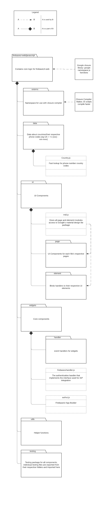

# FirebaseUI Web

[FirebaseUI Web](#firebaseui-web)
  - [Report Overview](#report-overview)
  - [What is the software system, and what does it do?](#what-is-the-software-system-and-what-does-it-do)
    - [About](#about)
  - [Who created the software, and who currently "maintains" it?](#who-created-the-software-and-who-currently-maintains-it)

## Report Overview

### What is the software system, and what does it do?

Taken from the main repository: [FirebaseUI Web](https://github.com/firebase/firebaseui-web)

### About
FirebaseUI is an open-source JavaScript library for Web that provides simple, customizable UI bindings on top of Firebase SDKs to eliminate boilerplate code and promote best practices.

*FirebaseUI Auth provides a drop-in auth solution that handles the UI flows for signing in users with email addresses and passwords, and Identity Provider Sign In using Google, Facebook and others. It is built on top of Firebase Auth.*

In simpler terms, FirebaseUI helps allow componts to be created within a web-app. On the otherhand FIrebaseUI auth will also allow for users to be able to login into a web-app using their Google account, not having to create an entirely new account for a specific web-app.

### Who created the software, and who currently "maintains" it?

FirebaseUI Web is an extension / addition to Firebase that was created by Google. As this is an open source codebase, anybody can contribute to it. With that being said, all submissions that are made, even those that are project members, require review. They use GitHub pull requests for this purpose.

## Development View

This diagram represents the basic file structure of the codebase, not sure about server calls since they are locked behind Google implementations of certain imports and exports; There are many more modules under the folder, @Harper I will add those in for the final draft if there's not enough detail in the current diagram (Ryan)

### Testing Strategy
Each module is paired with a testing file under the moniker of `[module name]_test.js` or similar. It appears that all these tests are imported into the testing folder, where they are tested as aggregates of the main component that they are a part of. Running `npm run test` works for testing.

## Applied Perspective

### Introduce perspective
The architectural perspective that we have chosen to review for this system is security. In Software Systems Architecture by Nick Rozanski and Eoin Woods, security is defined as the set of processes and technologies that allow the owners of resources in the systems to reliably control who can access which resources. When talking about “who” is the audience in this particular perspective, they identify it as people and parts of software that form personas that has a sense of security identity (referred to as principals). In regard to what is meant by “resources,” they mean the different sensitive parts of the system such as operations, data elements, and subsystems. Finally, regarding “access,” it refers to the actions or operations that the principals want to successfully perform which includes reading the resources, changing the resources, and executing those resources; at the same time, there has to be limited access for the principals.

### System concerns
When considering how this perspective is applicable to our system, we think it fits because the repository highlights features of user authentication. It includes features such as interaction with identity providers like Google/Facebook, authentication based on phone numbers, sign up/in with email accounts, resetting passwords, account duplication prevention, one-tap sign up integration, and signing up as a guest. This is a collection of architectural activities which are used to ensure quality for the system’s views. Authenticating users of a system is a very important tactic that is used to help achieve excellence.

We consider some of the biggest concerns regarding the security perspective include confidentiality, detection and recovery, and security mechanisms. Confidentially concerns address keeping information from being viewable to anyone who doesn’t have the right to see that certain information. With this user authentication system, they directly address and try to solve the concern of confidentiality. Detection and recovery involves the system’s ability to detect breaches and recover from those break ins; this system detects whether particular information (like an email) is registered twice.

## Styles/Patterns Used

### Identifying Architectural Style
We would suggest that the architectural style that is found throughout this code base would have to be a Flux architectural style. Looking into the flow of information within the different components, we found that there is a unidirectional flow of information, as it will flow in one direction. The components of the codebase build off of eachother but will only be taking in the necessary parameters to complete the function that they are asked to complete. As this will be dealing with user authentication, there will be containment implemented to add a level of security to the data being used. 

### Design Pattern and Explanation 
- Adapter intent:
    - **FirebaseUiHandler**: takes a configuration object that specifies the tenants and providers for user authentication 
- Proxy Pattern:
    - Found in the API reference of the FirebaseUIHandler 
- Composite Pattern:
    - Found when configuring sign-in providers
- Strategy Pattern:
    - Found within phoneconfirmationcodetesthelper.js

## Architectural Assessment

### Single Responsibility Principle
- Every class only has one responsibility.
  - Each module is separated from each other and have one purpose; UI components, logic functions, authentication and database screens, etc
  - Modules are separated in different files with different names and are grouped together based on their type of purpose(“testing” folder have files that test the code)
### Open-closed principle
- Software entities are open for extension but closed for modification
    - Allows users to use the class for firebase authentication while allowing users to customize its UI
    - The initial code should not be modified but could be utilized or extended for other purposes that fulfills something else
### Interface Segregation Principle
- Different client-specific interfaces, rather than one general purpose interface
    - The classes do not depend on things that they don’t need; only takes in needed parameter to run the code
    - Does not contain unnecessary code or redundancy

## System Improvement

### Refactoring
1. The `tearDown()` function is defined multiple times with both the same and different definitions.
    - `tearDown()` under the `page` folder only refers to one implementation. Additionally, all tests under the page folder have a dependency on the `pageTestHelper` module, so `tearDown` will be extracted to that place.
2. Testing modules are in the same folder as the modules that they are testing
    - These should be moved to a separate testing folder so that developers will have an easier time finding the main code file they want to edit rather than opening up both the test file and the non-test file if they are unable to read the full filename
3.
4.
5.
6.
7.

### Bug Fix

### Feature Improvement

### Testing
Each component in FirebaseUI-Web is paired with a testing file. In the case that we will examine for this report, common.js contains some functions that are neither mentioned nor tested for in common_test.js, namely `listenForInputEvent()`, `listenForEnterEvent()`, `listenForFocusInEvent()`, `listenForFocusOutEvent()`, and `listenForActionEvent()`. Perhaps these functions were tested from a different library since there are `@template` tags in the function comments, which lead me to believe that these functions were copy pasted from somewhere else, but that also begs the question, "if these functions were taken from somewhere else, why not just import them and provide more abstraction?" To that, I have no idea.

Note: theoretically, this is how testing should work, but due to a slew of deprecated packages that I can not figure out, we have elected to avoid implementing additonal unit tests as there is no way to validate any additional tests.
